# 🚀 Daily Growth Tracker

**Daily Growth Tracker** is a smart productivity and personal growth application designed to help users **track daily tasks, build habits, monitor calorie intake, and visualize personal progress** through an intuitive, data-driven interface.

---

## 🎯 Project Aim

The aim of this project is to provide a **centralized platform for productivity, health awareness, and personal development**, enabling users to track tasks, habits, and calorie consumption while gaining meaningful insights into their growth over time.

---

## 📝 Problem Statement

In today’s fast-paced lifestyle, individuals face challenges such as:

* Managing daily tasks and routines efficiently
* Maintaining habit consistency
* Tracking health metrics like calorie intake
* Measuring long-term personal growth

Most existing applications focus on only one aspect—either productivity or health—without offering an integrated solution.

👉 **Daily Growth Tracker bridges this gap** by combining **task management, habit tracking, and calorie monitoring** into a single cohesive platform.

---

## ✅ Core Features

| Feature                       | Description                                                  |
| ----------------------------- | ------------------------------------------------------------ |
| **User Authentication** 🔒    | Secure login and registration using Firebase Authentication  |
| **Dashboard Overview** 📊     | Centralized view of productivity, habits, and calorie stats  |
| **Task Management** ✅         | Create, update, delete, and complete daily tasks             |
| **Habit Tracking** 🌱         | Track daily habits and maintain streak consistency           |
| **Calorie Tracker** 🔥        | Log daily calorie intake and monitor nutritional patterns    |
| **Profile Management** 👤     | Personalized user profiles with growth statistics            |
| **Interactive UI** 🖱️        | Smooth, responsive interactions for better usability         |
| **Progress Visualization** 📈 | Graphs and indicators showing productivity and health trends |
| **Search & Filtering** 🔍     | Quickly locate tasks and entries based on criteria           |

---

## ⚙️ How the System Works

1. **User Authentication:** Secure login and account management.
2. **Task & Habit Creation:** Users define daily goals, habits, and routines.
3. **Calorie Logging:** Users record calorie intake for health awareness.
4. **Progress Tracking:** Dashboard updates productivity, habits, and calories in real time.
5. **Growth Analysis:** Visual reports help users identify improvement areas.

---

## 💻 Tech Stack Used

### Frontend

* **React.js** – Component-based UI development
* **Tailwind CSS** – Responsive and modern UI styling
* **Vite** – Fast development server and build tool

### Backend & Services

* **Firebase Authentication** – Secure user authentication
* **Firestore Database** – Real-time data storage
* **Firebase Hosting** – Application deployment

### Data Visualization

* **Chart.js / Recharts** – Visual analytics and progress charts

---

## ⚛️ Role of React in the Project

React serves as the **core framework** of the application:

* Modular component architecture for scalability
* Efficient state management using React Hooks
* Fast UI updates through Virtual DOM
* Easy integration of new features such as analytics and AI recommendations

React ensures the application is **maintainable, performant, and future-ready**.

---

## 🔍 Key Insights Provided

* Task completion and productivity trends
* Habit streak consistency analysis
* Daily calorie intake patterns
* Visual feedback that improves motivation and accountability

These insights help users make **data-driven decisions for personal growth and health improvement**.

---

## 🌟 Future Enhancements & Optimization

* AI-based productivity and calorie recommendations
* Advanced analytics dashboard
* Gamification with rewards and achievement levels
* Reminder and notification system
* Calendar and third-party integrations
* Performance optimizations using lazy loading and caching

---

## 🏁 Conclusion

**Daily Growth Tracker** successfully integrates **productivity tracking, habit formation, and calorie monitoring** into a single, user-friendly platform.

By leveraging **React for a dynamic frontend** and **Firebase for a secure backend**, the project delivers a **scalable, efficient, and real-world solution** for personal development and health awareness.

This project demonstrates strong proficiency in **modern web development, system design, and user-centric application development**, making it suitable for real-world deployment and future expansion.

---

## WORKFLOW

```mermaid
flowchart TB

%% ================= USER =================
USER[👤 User]

%% ================= FRONTEND =================
subgraph FE["🖥️ FRONTEND (React SPA)"]
  FE_UI[🎨 UI Shell]

  subgraph FE_FEATURES["📦 App Features"]
    TODO[📝 To-Do List<br/>Custom XP]
    TASKS[🎯 Daily Tasks & Habits]
    CAL[🔥 Calorie Tracker]
    AI[🤖 AI Assistant]
  end

  DASH[📊 Dashboard]
  PROFILE[👤 Profile]
  LEADER[🏆 Leaderboard]
end

%% ================= FRONTEND LOGIC =================
subgraph FE_LOGIC["🧠 Frontend XP Logic"]
  VALIDATE{✔ Already completed?<br/>✔ Daily XP limit?}
  ERROR[❌ Toast / Error]
end

%% ================= BACKEND =================
subgraph BE["⚙️ BACKEND (Node + Express)"]
  AUTH[🔐 Auth Middleware]
  RULES[🧠 XP Rules Engine]
  CALC[🧮 XP & Level Calculator]
  SERVICE[📦 User Progress Service]
end

%% ================= DATABASE =================
subgraph DB["🗄️ DATABASE"]
  USERS[(MongoDB<br/>Users)]
  LOGS[(MongoDB<br/>XP Logs)]
  FIRE[(Firebase<br/>Leaderboard)]
end

%% ================= FLOW =================
USER --> FE_UI
FE_UI --> FE_FEATURES

TODO --> VALIDATE
TASKS --> VALIDATE
CAL --> VALIDATE
AI --> VALIDATE

VALIDATE -->|❌ Invalid| ERROR
VALIDATE -->|✔ Valid| AUTH

AUTH --> RULES
RULES --> CALC
CALC --> SERVICE

SERVICE --> USERS
SERVICE --> LOGS
SERVICE --> FIRE

USERS --> DASH
USERS --> PROFILE
FIRE --> LEADER

```

